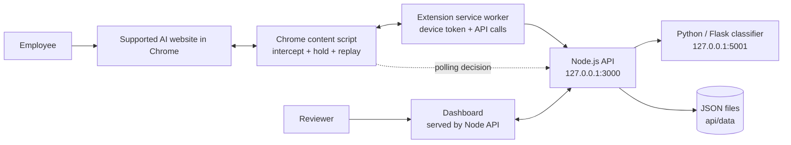

# SentryAI
## Product & Technical Architecture Report

**Founder / executive briefing**  
**Version:** 1.0 · **Prepared:** 28 September 2026  
**Product stage:** Local proof of concept / MVP  
**Audience:** Company leaders, founders, product, security and compliance teams

---

## Executive summary

SentryAI is a browser-based AI-use monitoring and control prototype. A Chrome extension watches selected AI websites, intercepts supported text and file submission actions, sends content to a locally running classification service, and holds flagged or uninspectable submissions until an administrator reviews them in a dashboard. The dashboard records outcomes, raises local alerts, and provides an internal incident-draft form and an activity-derived AI processing register.

The prototype demonstrates a useful product thesis: give organizations visibility and a human decision point before business or personal information is submitted to supported web-based AI tools. It includes a small rule-based classifier for Indian identifiers and business-risk signals, local JSON storage, event summaries, and reference mappings to Indian privacy, cyber and sector frameworks.

**It is not yet a production enterprise governance platform or a compliance product.** The current build is single-tenant, uses a local API and JSON files, has no organization identity/SSO or role-based dashboard access, and does not establish vendor processing geography. Some compliance records are manually entered or inferred from logs. The classifier is heuristic, and its coverage varies by content format and website. Before a customer pilot, stored prompt handling and the legacy event route need security review; this report calls out those findings explicitly.

### One-sentence explanation for a CEO

> SentryAI is a browser control layer that detects risky information in employee submissions to selected AI websites, pauses flagged submissions for human review, and creates an audit trail for security and governance teams.

### What the MVP does today

- Supports browser pages for ChatGPT, Claude, Gemini, DeepSeek, Perplexity, Grok, Grammarly and QuillBot.
- Intercepts supported send, form-submit, file-picker, drag-and-drop and pasted-image actions.
- Scans text and extractable file content locally through the Python classifier.
- Holds detected-risk or unscannable submissions for dashboard Allow / Decline review; clean submissions continue.
- Stores event metadata, detected categories, decision and user/tool context; provides summary cards and desktop alerts.
- Generates a log-derived register and allows JSON export; saves internal incident drafts for later review/export.

### What it does not establish

- It cannot prove that a prompt reached an external AI provider or identify the provider's actual server country.
- It does not detect every AI tool, desktop app, integration, API, browser variant or website-specific submission path.
- It does not verify a person's age, parental consent, legal basis, breach status, affected-person count or regulatory applicability.
- It does not submit notices to CERT-In, the Data Protection Board, RBI, IRDAI or SEBI.
- It does not certify DPDP, CERT-In, RBI, IRDAI, SEBI or AI-governance compliance.

---

## 1. Product problem and value

Employees increasingly paste business material into general-purpose AI services. Existing web controls may see a destination or block an entire domain, while compliance teams need to understand what kind of information was involved, what decision was made and whether a response is needed.

SentryAI's prototype focuses on a narrow point in the workflow: the browser submission. It combines a local browser agent, a pre-send scan, a human decision queue and an audit dashboard. Its value proposition is **visibility plus a policy checkpoint**, rather than control over the AI provider or a guarantee about downstream processing.

### Product actors

| Actor | MVP interaction | Intended value |
|---|---|---|
| Employee | Uses supported AI websites; sees a SentryAI hold/allow/decline prompt when needed | Prevent accidental send while keeping ordinary clean use quick |
| Security / privacy reviewer | Opens dashboard, reviews pending submissions, decides Allow or Decline | Put a human checkpoint around flagged requests |
| Compliance / DPO team | Reviews activity and internal incident drafts; exports register and incident JSON | Gather investigation evidence and prepare internal review |
| IT / administrator | Starts local services and loads the unpacked Chrome extension | Operates the local demonstration environment |

---

## 2. System architecture

### Component diagram



### Runtime services

| Component | Runtime / address | Responsibility |
|---|---|---|
| Chrome extension | Runs in Chrome on supported web origins | Intercepts supported submission actions, prepares scans, displays holds and relays decisions |
| Ingestion API + dashboard server | Node.js, `127.0.0.1:3000` by default | Device registration, scan workflow, approval decisions, event/incident endpoints, summary and static dashboard |
| Classification service | Python / Flask, `127.0.0.1:5001` | Regex/heuristic text analysis, file extraction, OCR attempt, categories and redacted preview |
| Persistence | JSON files under `api/data/` | Devices, tools, events, declined fingerprints and incident drafts |
| Dashboard | Static HTML/CSS/JavaScript served by API | Review queue, activity, summaries, local alerts, register and incident draft UI |

Services communicate over local HTTP. The browser extension uses a device token for ingestion endpoints. Dashboard/report endpoints are not protected by user login or enterprise role controls in this MVP. The default API bind address is loopback, which keeps this prototype local to one computer unless its configuration is changed.

### Text submission flow

1. The content script sees a supported send/submit action and temporarily prevents the page from sending it.
2. It reads text from a generic textarea/contenteditable/textbox selector and asks the extension worker to call `POST /v1/scan`.
3. The API authenticates the registered browser installation and asks the classifier to inspect text.
4. The API keeps a short-lived scan result in process memory. It returns categories and, where relevant, a masked preview to the extension.
5. If content is clean, the extension replays the send. If flagged, it waits for the dashboard reviewer. If scanning fails or times out on this scan path, the request is treated as unscannable and held for review.
6. The reviewer chooses Allow or Decline. The extension polls approval status, then replays the original action only after Allow; Decline prevents submission. A chosen outcome is recorded through `POST /v1/events` with a single-use `scanId`.
7. The dashboard polls for activity and approvals every five seconds. New alert/blocked/redacted events can trigger a sound and browser desktop notification (if enabled).

### File submission flow

The content script intercepts selected file-picker, drop and pasted-file actions. Small files are base64-encoded and sent to the local API; the classifier extracts text or attempts OCR and scans the extracted text. Larger-than-extension-limit files are not uploaded for content scanning: their size and per-chunk hashes are sent as an unscannable item so an exact declined repeat can be recognized. File content cannot be masked in this version; the reviewer can allow or decline. Declined files are removed from the page control where the supported site flow permits it.

### Decision model

The policy engine requests human permission when categories in its sensitive set are detected, or when file/text inspection reports partial or unscannable content. In the scan-and-approval flow, a flagged scan cannot be recorded as clean, and a declined scan cannot be recorded as sent. A clean scan can proceed without dashboard approval. Legacy event ingestion without a `scanId` remains available for older clients and has different failure behavior; see the security review section.

---

## 3. Classification and data signals

The classifier is a lightweight Python implementation, not a trained enterprise DLP model. It runs recognizers over text (including overlapping chunks for long inputs), aggregates category/confidence signals and constructs a redacted preview for detected spans.

### Existing signal families

| Category family | Examples in the code | Detection approach |
|---|---|---|
| Indian identifiers / contact data | Aadhaar, PAN, phone, email, ID documents | Formats, Aadhaar checksum where applicable, OCR-friendly document-heading combinations |
| Payment / finance | Card number, IFSC, financial context | Luhn check, code pattern, keyword/currency heuristics |
| Business records | Customer, employee/HR, company confidential, database export | Context terms, field patterns and configurable organization keywords |
| Technical secrets / material | Password/API token, source code | Token-format regex and code-token density heuristic |
| Operational risk labels | `HEALTH_DATA`, `BIOMETRIC_DATA`, `CHILD_DATA` | Keyword/context patterns; heuristic indicators only |

Health, biometric and child-related categories are product risk labels. They are **not represented as a DPDP statutory “sensitive personal data” tier**. A child-related text signal cannot establish that a person is under 18, establish a data principal's identity, or validate verifiable parental consent. False positives and misses are expected; organization-specific evaluation is necessary.

### File extraction coverage

`file_extractor.py` supports common text/code formats, PDF text extraction with available local tooling/fallbacks, Office Open XML documents, small ZIP inspection and image OCR when Pillow, pytesseract and the Tesseract binary are available. Encrypted, damaged, unsupported or insufficiently readable content is reported as partial/unscannable and the scan path asks for review. OCR and extraction are not guaranteed to recover every page, embedded object, handwriting, image or layout.

### Redaction behavior

Detected spans are replaced with `[REDACTED:<CATEGORY>]` for the preview. Heuristic whole-document matches are used as labels and may not provide meaningful span-level masking. Files are not masked. Critically, the classifier's redaction function returns the input unchanged when there are no matches; current persistence paths can store that value in a field named `redactedText`. Consequently, the code does **not** support the blanket claim that only redacted text is retained. Treat clean prompt persistence as a high-priority privacy/security issue before using real customer data.

---

## 4. Dashboard capabilities

### Activity overview

Summary cards count total events, sensitive submissions allowed by the reviewer, declined/blocked events, masked sends, distinct tool strings seen and the top category. The Recent Activity table shows timestamp, user identifier, AI tool domain, event type, categories, decision, employee choice, redacted/detail preview and destination verification status. Historical rows without a stored destination field display “not verified.”

### Pending approvals

The dashboard lists active in-memory scans requiring a decision and exposes Allow / Decline. Scan records expire from process memory after 15 minutes; the extension polls for at most five minutes. A server restart loses pending scans. This is not a durable approval queue.

### Internal incident report

The form stores title, occurred/discovered times, tool, severity, categories, affected-person estimate/basis, containment notes, free-form notes and status. Exports are JSON. It is an **internal draft**: it does not confirm a breach, compute a legally binding deadline, assess entity applicability, generate an authority-specific submission, or send it to an authority. Incident creation is user initiated rather than automatically promoted from an event.

### AI processing register

`GET /v1/ropa` groups recorded events by tool and category and provides activity count and first/last observed times. Entries without categories are grouped under `UNCLASSIFIED`; page visits can therefore contribute. One event with multiple categories appears in multiple tool/category rows, so summing all rows can count the same event more than once. Department is not collected; business purpose is not captured; destination is not verified. This is a useful internal activity register, **not a complete statutory or GDPR-style RoPA and not compliance evidence by itself**.

### Framework references

The dashboard presents DPDP as the primary privacy reference and adds conditional mappings to CERT-In, RBI, IRDAI, SEBI and India's AI Governance Guidelines. These are reference notes, not an implemented control-management system: the app does not maintain legal applicability per client, version a control library, assign owners/due dates, collect independent evidence, or issue a compliance status.

---

## 5. API and internal interfaces

| Method / path | Purpose | Authentication / persistence |
|---|---|---|
| `GET /health` | API health | No auth |
| `POST /v1/auth/device` | Register extension installation; issue UUID token | No existing token required; token stored in local JSON |
| `POST /v1/scan` | Scan prompt/files before site submission | Bearer device token; scan metadata in process memory for up to 15 min |
| `GET /v1/approvals` | List pending dashboard approvals | No dashboard login in local MVP |
| `POST /v1/approvals` | Record Allow / Decline | No dashboard login in local MVP |
| `GET /v1/approvals/:scanId` | Extension polls decision | Bearer device token and device match |
| `POST /v1/events` | Record scan outcome or legacy event | Bearer device token |
| `GET /v1/events?limit=n` | List recent events | No dashboard login in local MVP |
| `GET /v1/summary` | Aggregate counts by tool/category/decision | No dashboard login in local MVP |
| `GET /v1/tools` | List seeded AI-tool domains | No auth |
| `GET /v1/ropa` | Derive processing-register rows from events | No dashboard login in local MVP |
| `GET /v1/incidents` | List internal incident drafts | No dashboard login in local MVP |
| `POST /v1/incidents` | Save an internal incident draft | No dashboard login in local MVP |
| `GET /`, `/app.js`, `/style.css` | Serve static dashboard assets | No auth |
| Classifier `GET /health`, `POST /classify`, `POST /classify-file` | Health, text classification and file classification | Local Flask endpoints; no authentication in prototype |

---

## 6. Source-file guide

### Browser extension

| File | Responsibility |
|---|---|
| `extension/manifest.json` | Manifest V3 permissions, allowed website patterns, content script and popup registration |
| `extension/content.js` | Generic field/send selectors; hold and replay; text/file scanning; file-picker/drop/paste interception; approval polling; user-facing overlay/toast; discovery and outcome events |
| `extension/background.js` | Registers/caches device token in `chrome.storage.local`; forwards scan, approval and event requests to the local API |
| `extension/popup.html` | Small toolbar popup markup/styles and local dashboard link |
| `extension/popup.js` | Shows whether the local browser installation has a cached device token |
| `extension/icons/icon16.png`, `icon48.png`, `icon128.png` | Toolbar/extension icons |

### Node API and data store

| File | Responsibility |
|---|---|
| `api/src/server.js` | HTTP server, CORS preflight, device auth, scan memory, approvals, events, summaries, incidents, register aggregation, AI catalog seeding and static serving |
| `api/src/policyEngine.js` | Sensitive category set, unscannable/partial permission rule, action validation and allow/alert/blocked/redacted decision reason |
| `api/src/classificationClient.js` | HTTP client to Python service with separate text/file timeouts and fallback error result |
| `api/src/db.js` | JSON collection read/write helpers, UUID IDs and per-process serialized mutation queue |
| `api/package.json` | Node metadata and `npm start`; no package dependencies are declared |
| `api/data/aiTools.json` | Seeded supported AI domain/name/risk-tier reference rows |
| `api/data/devices.json` | Registered device/user IDs and device tokens |
| `api/data/events.json` | Persistent audit-event JSON documents |
| `api/data/incidents.json` | Persistent internal incident draft documents |
| `api/data/declinedFingerprints.json` | Created at runtime for device-keyed HMACs of previously declined content; ignored by Git |

### Classification service

| File | Responsibility |
|---|---|
| `classification-service/app.py` | Flask endpoints, response aggregation, risk priority, text/file classification and service health |
| `classification-service/recognizers.py` | Regex/heuristic detectors, custom keyword loader, chunked analysis and redacted-preview generation |
| `classification-service/file_extractor.py` | Text extraction and OCR attempts for supported file formats; size/page/archive caps; scan-status result |
| `classification-service/sensitive_terms.json` | Customer/company keyword lists; currently empty by default |
| `classification-service/requirements.txt` | Flask, Pillow, pytesseract and optional pypdf dependencies; Tesseract/Poppler are separate OS tools |

### Dashboard and operator files

| File | Responsibility |
|---|---|
| `dashboard/index.html` | Page structure, summary cards, approval queue, activity table, framework notes, incident form and register table |
| `dashboard/app.js` | API polling, DOM rendering/escaping, approval actions, local notifications, incident submission and JSON exports |
| `dashboard/style.css` | Responsive dashboard layout, cards, tables, forms and responsive breakpoints |
| `README.md` | Developer setup, run instructions and product notes |
| `start.sh` | Starts classifier and API on Unix-like shells and stops child processes on exit |
| `docker-compose.yml` | Future production-shaped reference only; MongoDB/Redis are not wired into the MVP |
| `test/integration_test.sh` | Legacy integration script; currently stale and destructive (see validation section) |
| `.gitignore` | Excludes JSON data, Python bytecode/environment, Node packages and logs |
| `api-run.log`, `api-error.log`, `classifier-run.log`, `classifier-error.log` | Local runtime logs; not product source and should not contain customer content |

Environment directories `.venv`, `.uv-python` and `.uv-cache` are local runtime/dependency artifacts, not source modules. Their exact contents are machine-specific.

---

## 7. Data model and retention

The MVP stores JSON collections on disk. The principal records are:

| Record | Representative fields | Purpose |
|---|---|---|
| Device | `_id`, `orgId`, `userId`, `deviceToken`, `lastSeen` | Identify an extension installation for API calls |
| Event | `orgId`, `deviceId`, `userId`, `tool`, `url`, `eventType`, `rawTextHash`, `redactedText`, file metadata, `categories`, `decision`, `userAction` | Recent activity, decisions and register aggregation |
| Declined fingerprint | `deviceId`, HMAC `fingerprint`, content kind, categories, scan status | Block exact previously declined prompt/file repeats from the same browser installation |
| Incident draft | title/timestamps/tool/severity/categories/affected-person estimate/containment/notes/status/report guidance | Internal review and JSON export |
| AI tool | domain/name/risk tier | Seeded tool reference catalog |

Raw file bytes are processed in memory and not placed in the event JSON. File metadata can include filename, MIME type, size and content hash. The raw prompt issue described above means prompt persistence must be verified/fixed before real customer deployment. Device tokens are stored in a local JSON file in the current design. The JSON writer serializes updates only within one Node process; it is not a multi-instance transactional database.

Declined-content fingerprints are HMAC-based with the device token and allow exact content repeats to be recognized across supported tools for that installation. The record does not keep the original text bytes, but it is still a persistent, linkable enforcement artifact and needs documented retention/deletion controls in a customer deployment.

---

## 8. Security, privacy and production-readiness review

This section is intentionally direct so founders can distinguish a demo from a deployable service.

### Priority 0 — resolve before using real customer prompts

1. **Prompt retention:** Clean classification returns the original text as `redacted_text`; event creation persists it to `redactedText` on scan outcomes and legacy event flow. The field name is not proof of redaction. Decide whether to store no prompt preview for clean messages, then verify the entire path and existing JSON data handling.
2. **Legacy fail-open path:** `classificationClient.js` produces an empty classification on timeout/error. The normal extension scan route translates text scan failure to `unscannable` and requests permission, but legacy `POST /v1/events` without `scanId` does not apply the same failure status and can evaluate empty categories as allow. Remove, protect or make the legacy route fail closed before broadening clients.
3. **Dashboard/API access control:** Device ingestion endpoints require a bearer token, but report, event, summary, tools and approval routes have no dashboard login. Loopback binding helps for a one-computer demo only; it is not an access-control model for a shared server or multi-laptop deployment.

### Priority 1 — needed for enterprise pilots

- Replace demo user identity with SSO/managed identity; implement tenant boundaries, reviewer roles, audit trail for reviewer actions, session protection and administrative controls.
- Replace local JSON storage with a supported durable database, backup/restore, retention policies, migrations and multi-instance-safe writes.
- Move secrets/tokens to a protected credential store; rotate and revoke tokens; define audit-log integrity and access policy.
- Add a reviewable data-retention configuration and an export/delete process covering events, incident drafts and declined fingerprints.
- Add configurable, source-backed vendor data residency profiles. Keep destination unknown unless verified for provider, account/plan, tenant configuration and contractual terms; a destination should not be guessed from a website domain.
- Validate browser extension selectors and send interception on every supported site/version. Add controlled compatibility monitoring and a clear policy for unsupported submission paths.
- Conduct classifier precision/recall evaluation using customer-approved synthetic datasets, language coverage, OCR tests, attack/bypass tests and false-positive tracking.
- Secure service-to-service boundaries, rate limits, CSRF/dashboard auth, request validation, security headers, dependency/build provenance and operational monitoring before remote deployment.

### Priority 2 — governance workflow maturity

- Make incident creation link to selected event(s), preserve timeline/evidence references and capture confidence/known-vs-estimated values.
- Maintain rule versions, responsible owners, due dates and source citations by client type/jurisdiction; do not compute a hard deadline unless the relevant trigger and rule version are established.
- Add client-entered purpose, department, data principal estimate basis, vendor/processor, region evidence and retention fields to the processing register.
- Support incident status lifecycle, review/approval, immutable history and authority-specific export templates; submission should remain an authorized human action.
- Separate observed browser activity from confirmed provider transmission or confirmed legal breach.

---

## 9. Indian framework positioning

Framework notes are implementation references, not a legal applicability opinion. Current legal position must be reviewed for each customer, entity type, data flow and effective date.

| Framework | Accurate product mapping | Important boundary |
|---|---|---|
| DPDP Act, 2023 and Rules | Data-risk monitoring, access/decision audit evidence, internal incident preparation and processing inventory can support privacy governance | Child-related detector is only a signal; no consent/lawful-use determination. Commencement is staged; confirm which provisions are operative on incident date. A log-derived register is not automatically a mandatory statutory RoPA for every company. |
| CERT-In Directions (2022) | Event timeline and incident draft may help responders collect facts | Six-hour requirement is tied to specified reportable cyber incidents and applicable entities; an AI policy alert does not automatically equal a reportable breach. This product does not notify CERT-In. |
| RBI | Payment-system data localization is applicable to covered payment-system providers; IT outsourcing directions apply to specified regulated entities, including NBFCs | Do not market “all financial customer data must stay in India” as a universal RBI rule. This MVP does not verify external AI service storage/processing region. |
| IRDAI | Monitored events and internal incident notes may support insurer governance review | Current circular, regulated-entity category, scope and reporting need client-specific review. |
| SEBI CSCRF | Monitoring and incident evidence can contribute to a wider cyber-response evidence pack | Does not replace SOC, portal submissions, root-cause analysis, cyber-resilience or other SEBI controls. |
| India AI Governance Guidelines | Product can describe a partial operational alignment around accountability, risk signals, human review and traceable decisions | The official guidelines were released 5 November 2025; they are principle-based guidance, not a SentryAI compliance certificate. MVP does not evaluate model fairness, explainability or model safety. |

### Suggested CEO pitch

> “SentryAI adds a browser-level governance checkpoint for employee use of selected AI websites. It scans supported prompt and file submissions before they are sent, pauses configured risk signals for human review, and records observed activity and decisions. The dashboard helps security and privacy teams prepare internal evidence against DPDP and relevant cyber or sector frameworks. We report vendor destination as unverified until supported by account-specific evidence; we do not claim that an alert proves a breach or that the product certifies compliance.”

### Claims to avoid in an external pitch

- “We make you DPDP compliant” or “we meet every RBI/IRDAI/SEBI control.”
- “All ChatGPT/Gemini/Claude data goes to the USA” or “this tool proves the data stayed in India.”
- “We detect every AI app and every data leak.”
- “We automatically report breaches within six hours / 72 hours.”
- “This is a statutory RoPA” or “we verify parental consent.”

---

## 10. Running the local demo

### Prerequisites

- Node.js 18 or newer.
- Python 3.9 or newer and the packages in `classification-service/requirements.txt` (the workspace currently has local Python environments).
- Tesseract on PATH if image OCR is required. Poppler utilities are optional PDF helpers.
- Chrome for the browser extension.

### Start

From the project root in a Unix-like shell:

```bash
./start.sh
```

The script starts Flask on `http://127.0.0.1:5001` and Node API/dashboard on `http://127.0.0.1:3000`. Open the dashboard URL. In Chrome, open `chrome://extensions`, enable Developer mode, choose **Load unpacked**, and select the `extension/` directory. The extension is configured for a local API URL; a second laptop cannot use the other laptop's loopback address as a shared API. Multi-device operation needs a deliberately deployed, secured API and identity model.

On Windows, run the Python classifier from `classification-service` and the Node server from the project root/API entry point in separate terminals, or use the existing hidden processes if the demo is already running. Avoid starting a second process on occupied ports.

### Persistence and reset

Runtime data is in `api/data/*.json`. Do not erase these files to “reset” a live demo without first exporting/backing them up. Device registrations contain tokens, and event/incident records are operational data. `test/integration_test.sh` currently begins by deleting every JSON file in `api/data/`; do **not** execute it against the live workspace.

---

## 11. Validation status

Focused checks observed for this report include JavaScript syntax validation, Python bytecode compilation, sample recognition of health/biometric/child-related labels, API and classifier health endpoints, processing-register JSON generation, incident draft save/list behavior (temporary check record removed afterward), and dashboard HTTP response. These checks are not a full regression, security assessment or multi-site browser compatibility test.

The repository contains an older integration script whose expected tool count and data assumptions no longer match the current project. It also deletes `api/data/*.json` at startup. For those reasons it was not run against the user's active data. A new isolated disposable-data test suite should replace it before CI is claimed.

---

## 12. Recommended product roadmap

| Stage | Outcome | Main work |
|---|---|---|
| 0. Protect prompt data | Trustworthy MVP data behavior | Fix clean-prompt persistence, close legacy fail-open behavior, isolate test data and document retention |
| 1. Reliable single-organization pilot | Safe reviewer workflow | Authenticated dashboard, SSO identity, role model, database, durable approval queue, backup and audit history |
| 2. Verifiable governance evidence | Useful compliance-support product | Versioned control library, applicability questions, owner/evidence/status, vendor region source and processing-register fields |
| 3. Scale and coverage | Multi-customer service | Tenant isolation, centralized policy, admin configuration, supported browser/site matrix, security testing and deployment automation |
| 4. Higher assurance | Enterprise procurement readiness | Independent security review, privacy impact assessment, operational SLAs, incident playbooks, model/classifier validation and customer-specific legal mapping |

### First five engineering priorities

1. Prevent storage of unredacted prompt text and create a verification check proving it.
2. Remove or fail-close the legacy unscanned-event path.
3. Add dashboard authentication/authorization and replace demo identity.
4. Move to durable multi-instance-safe storage with retention and backup controls.
5. Turn framework links into a source-versioned, client-specific evidence register—starting with only the obligations that a launch customer actually needs.

---

## 13. Glossary

| Term | Meaning in this report |
|---|---|
| Content script | Browser extension code injected into a matching web page to intercept supported interactions |
| Service worker | Manifest V3 background extension process that owns device registration and API calls |
| Data principal | Individual to whom personal data relates under DPDP terminology |
| Heuristic classifier | Pattern- and keyword-based detector that estimates category signals; not proof of identity or legal status |
| Internal incident draft | SentryAI record for a human-led investigation; not a regulator filing |
| Processing register | Product's aggregate view of observed tool/category activity; not automatically a legally prescribed RoPA |
| Unverified destination | The product has no reliable provider/account-specific evidence for the processing or storage country |

---

## 14. Primary official references

Legal and regulator references below should be rechecked before each customer deployment or external compliance claim.

1. [Digital Personal Data Protection Act, 2023 — India Code](https://www.indiacode.nic.in/bitstream/123456789/22037/2/a2023-22.pdf)
2. [CERT-In Directions under Section 70B](https://www.cert-in.org.in/Directions70B.jsp) and [CERT-In FAQ on the 2022 Directions](https://www.cert-in.org.in/PDF/FAQs_on_CyberSecurityDirections_May2022.pdf)
3. [RBI Storage of Payment System Data direction](https://rbi.org.in/Scripts/NotificationUser.aspx?Id=11244)
4. [RBI Master Direction on Outsourcing of IT Services](https://www.rbi.org.in/Scripts/BS_ViewMasDirections.aspx?id=12486)
5. [IRDAI Information and Cyber Security Guidelines, 2023](https://irdai.gov.in/document-detail?documentId=3314780)
6. [SEBI Cybersecurity and Cyber Resilience Framework for Regulated Entities, 2024](https://www.sebi.gov.in/sebi_data/attachdocs/aug-2024/1724326790365.pdf)
7. [MeitY announcement of India AI Governance Guidelines, 5 November 2025](https://www.pib.gov.in/PressReleasePage.aspx?PRID=2186639&lang=2&reg=48) and [guideline document](https://static.pib.gov.in/WriteReadData/specificdocs/documents/2025/nov/doc2025115685601.pdf)

---

**Document note:** This report describes the code and configuration present in the SentryAI MVP workspace as reviewed on 28 September 2026. It is a product/engineering briefing, not legal advice, a security certification or a claim that the software meets every framework requirement.
